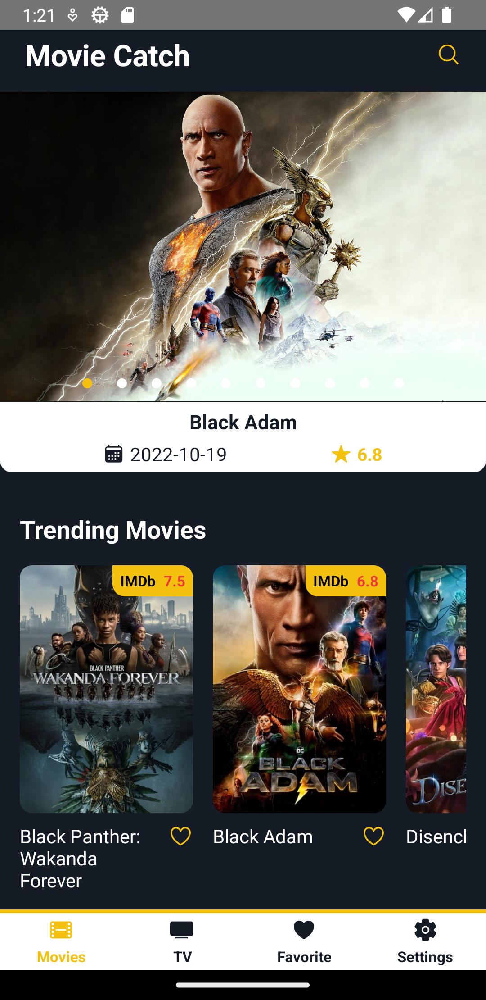
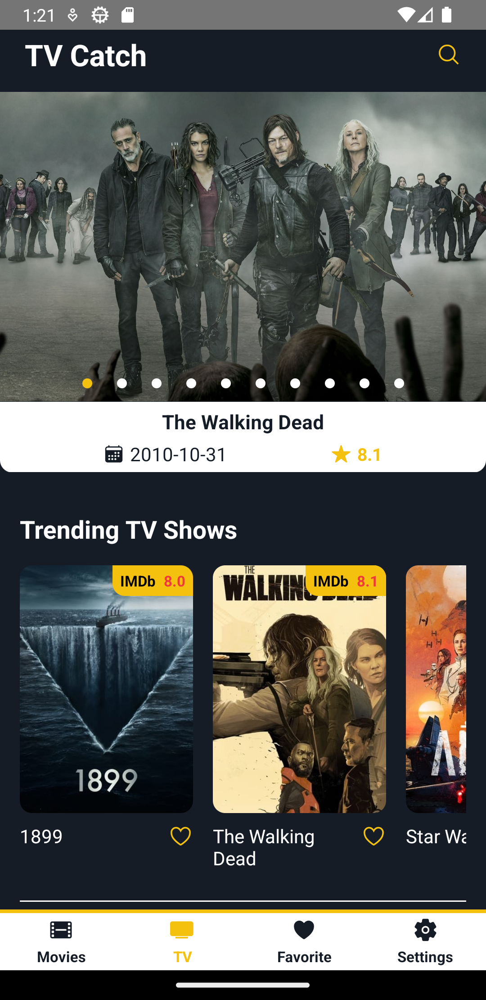
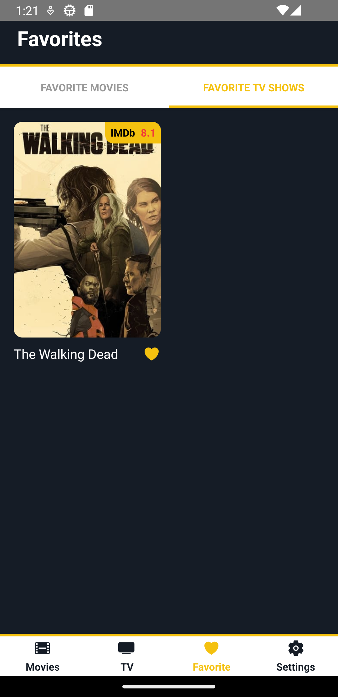

# MovieKit

## This repository is about the movie app built using React Native.

### Screenshots:

### ``` Movies ```
<div align="center">

</div>

### ``` TV ```
<div align="center">

</div>

### ``` Favorite ```
<div align="center">

</div>

### ``` Settings - Dark Theme ```
<div align="center">

</div>

### ``` Settings - Light Theme ```
<div align="center">

</div>

### ``` Movie Details ```
<div align="center">

</div>
